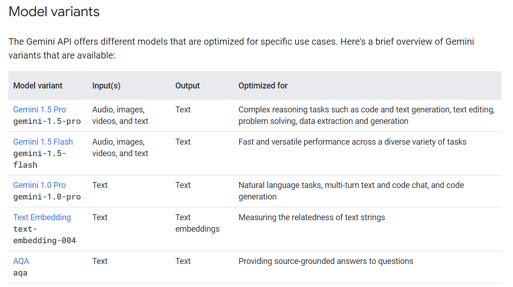
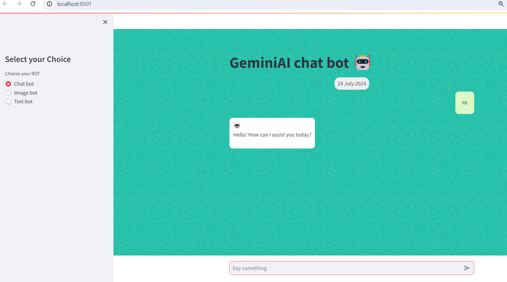
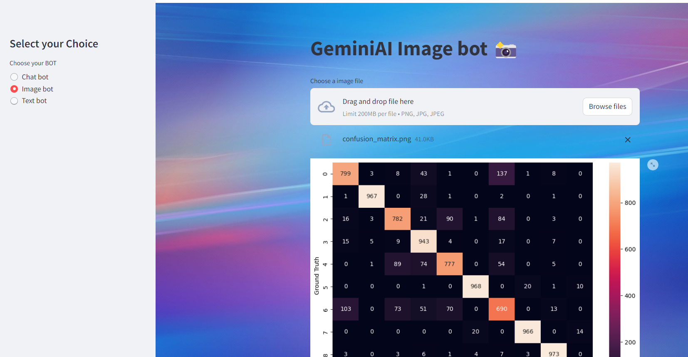

# GenAI-Gemini-ChatBot
🌟 LLM Models( Gemini)

# Table of Contents

- [Overview](#overview)
- [Requirements](#requirements)
- [Steps](#steps)
- [Usage](#usage)
- [Contribution](#contribution)
- [License](#license)
- [Contact](#contact)
- 
## Overview

The Gemini Pro/Flash Chat Bot project is designed to guide users through creating a chat bot with integrated image and text search capabilities. 
It aims to enhance bot interactivity and functionality, catering to both beginners and advanced developers. 
The project leverages Gemini Pro/Flash for a seamless development experience.

**Google GenAI LLM: Gemini Flash/Gemino Pro** 

**Google Generative AI Gemini Flash and deployed with Streamlit.**








## Requirements
- Python 3.11.5
- google.generativeai (`pip install google.generativeai`)
- streamlit (`pip install streamlit`)
- streamlit_cha (`pip install streamlit_cha`)
- PIL
- datetime
- python-dotenv

## Steps

1. Clone this repository to your local machine using:

```bash
  git clone https://github.com/alexvatti/GenAI-Gemini-ChatBot.git
```
2. Navigate to the project directory:

```bash
  cd GenAI-Gemini-ChatBot
```
3. Install the required dependencies using pip:

```bash
  pip install -r requirements.txt
```
## Usage

1. Run the Streamlit app by executing:
```bash
streamlit run Gemini-Bot.py
```

## Contribution

Feel free to contribute and enhance the project!

## License
This project is licensed under the [MIT License](LICENSE).

## Contact
For any inquiries or issues, please contact Alex at alexvatti@gmail.com.
