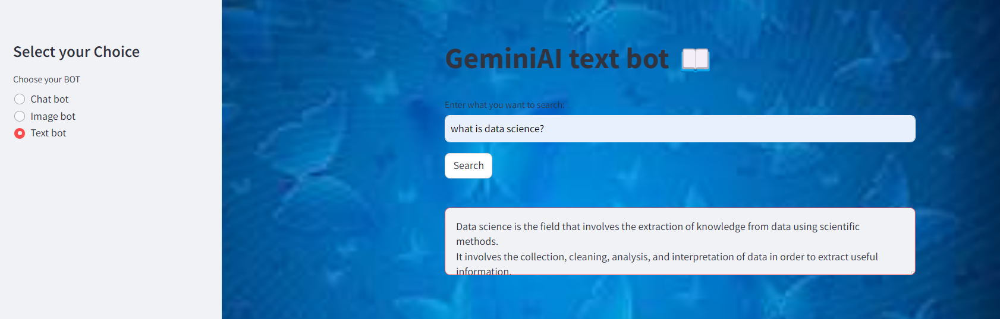

# GenAI-Gemini-ChatBot
🌟 LLM Models( Gemini)

# Google GenAI LLM: Gemini Flash/Gemino Pro 

Google Generative AI Gemini Flash and deployed with Streamlit.




## Steps

0.Python Version 3.11.5

1.Clone this repository to your local machine using:

```bash
  git clone https://github.com/alexvatti/GenAI-Gemini-ChatBot.git
```
2.Navigate to the project directory:

```bash
  cd GenAI-Gemini-ChatBot
```
3.Install the required dependencies using pip:

```bash
  pip install -r requirements.txt
```
## Usage/Examples

1. Run the Streamlit app by executing:
```bash
streamlit run app.py